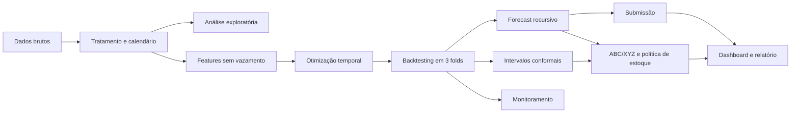

# DemandWise — Retail Demand Forecasting

Projeto completo de Ciência de Dados para previsão de demanda por loja e produto. O DemandWise organiza dados, investiga sazonalidade, cria features sem vazamento temporal, compara modelos, executa backtesting, quantifica incerteza e transforma as previsões em parâmetros indicativos de estoque.

[Acessar o dashboard executivo](https://demandwise-retail-intelligence.leonardofelipe422.chatgpt.site)

## Resultado principal

O modelo escolhido foi um `RandomForestRegressor` otimizado temporalmente:

| Indicador | Resultado |
| --- | ---: |
| MAE na validação oficial de 90 dias | **7,697** |
| RMSE | **9,866** |
| MAPE | **18,08%** |
| SMAPE | **15,98%** |
| Redução de MAE frente ao melhor baseline | **24,22%** |
| MAE médio em três folds de backtesting | **7,514** |
| Cobertura observada do intervalo de 90% | **93,65%** |

O horizonte futuro de 01/01/2018 a 31/03/2018 contém 45.000 previsões recursivas para 500 combinações de loja e produto.

## Problema de negócio

> Como prever as vendas futuras por loja e produto para melhorar o planejamento de estoque?

Uma previsão mais precisa pode apoiar:

- redução de ruptura e perda de vendas;
- menor excesso de mercadoria e capital imobilizado;
- antecipação de picos sazonais;
- priorização de lojas e produtos;
- definição de estoques de segurança e pontos de reposição.

## Dados

Fonte: [Store Item Demand Forecasting Challenge](https://www.kaggle.com/competitions/demand-forecasting-kernels-only), do Kaggle.

| Arquivo | Finalidade |
| --- | --- |
| `train.csv` | Histórico de vendas com a variável-alvo `sales`. |
| `test.csv` | Horizonte futuro sem `sales`. |
| `sample_submission.csv` | Estrutura esperada para a submissão `id,sales`. |

Cobertura da base:

| Dimensão | Valor |
| --- | ---: |
| Registros de treino | 913.000 |
| Período histórico | 01/01/2013 a 31/12/2017 |
| Lojas | 10 |
| Produtos | 50 |
| Séries loja-produto | 500 |
| Horizonte futuro | 90 dias |

Os dados brutos permanecem em `data/raw/` e não são versionados.

## Arquitetura do projeto



## Estrutura de pastas

```text
DemandWise/
├── data/
│   ├── raw/
│   └── processed/
├── notebooks/
│   ├── 01_data_understanding.ipynb
│   ├── 02_exploratory_analysis.ipynb
│   └── 03_forecasting_modeling.ipynb
├── reports/
├── dashboard/
├── models/
├── submissions/
├── tests/
│   └── test_project.py
├── src/
│   ├── make_dataset.py
│   ├── features.py
│   ├── train_model.py
│   ├── optimize_model.py
│   ├── train_ml_models.py
│   ├── backtesting.py
│   ├── training_window.py
│   ├── refresh_random_forest.py
│   ├── horizon_analysis.py
│   ├── uncertainty.py
│   ├── predict.py
│   ├── inventory.py
│   ├── monitoring.py
│   ├── export_dashboard_data.py
│   ├── evaluate_model.py
│   └── pipeline.py
├── requirements.txt
└── README.md
```

## Instalação

No PowerShell:

```powershell
python -m venv .venv
.venv\Scripts\Activate.ps1
python -m pip install -r requirements.txt
```

Tecnologias principais:

- Python, pandas e NumPy;
- scikit-learn e joblib;
- Plotly, Matplotlib e Seaborn;
- Jupyter Notebook;
- pytest;
- React e TypeScript no dashboard.

## Pipeline reproduzível

Executar o projeto completo:

```powershell
python -m src.pipeline --stage all
```

Executar somente otimização, backtesting, incerteza, estoque e monitoramento:

```powershell
python -m src.pipeline --stage improvements
```

O pipeline completo realiza treinamentos recursivos e pode levar vários minutos. Também é possível executar um estágio isolado:

```powershell
python -m src.pipeline --stage backtest
python -m src.pipeline --stage uncertainty
python -m src.pipeline --stage inventory
python -m src.pipeline --stage monitor
```

Ordem aplicada pelo pipeline completo:

1. tratamento dos dados;
2. feature engineering;
3. otimização dos hiperparâmetros;
4. avaliação dos baselines;
5. comparação dos modelos supervisionados;
6. backtesting em múltiplas janelas;
7. seleção da janela de treinamento;
8. atualização do Random Forest vencedor;
9. previsão futura;
10. comparação por trecho do horizonte;
11. intervalos de previsão;
12. segmentação e política de estoque;
13. monitoramento;
14. exportação dos dados do dashboard.

## Análise exploratória

Os notebooks identificam:

- crescimento de 35,2% entre 2013 e 2017;
- julho como mês de maior média diária histórica;
- domingo como dia de maior demanda;
- fins de semana aproximadamente 23,3% acima dos dias úteis;
- diferenças relevantes entre lojas e produtos;
- produtos com maior variação sazonal.

Execute:

```powershell
jupyter notebook
```

## Feature engineering sem vazamento

O script `src/features.py` cria:

| Grupo | Features |
| --- | --- |
| Defasagens | `lag_7`, `lag_14`, `lag_28` |
| Médias móveis | `rolling_mean_7`, `rolling_mean_14`, `rolling_mean_28` |
| Dispersão móvel | `rolling_std_7` |
| Médias históricas | `sales_by_store_mean`, `sales_by_item_mean`, `sales_by_month_mean` |

As janelas móveis começam em `sales.shift(1)`. As médias históricas são fechadas na data anterior; registros da mesma data não entram no histórico uns dos outros.

## Validação temporal e baselines

Os últimos 90 dias de 2017 formam a validação oficial. Nenhuma venda real desse período é usada nas features recursivas.

| Baseline | MAE | RMSE | SMAPE |
| --- | ---: | ---: | ---: |
| Média histórica loja-produto | 10,158 | 13,514 | 19,76% |
| Média dos últimos 7 dias | 11,494 | 15,089 | 21,87% |
| Média dos últimos 28 dias | 11,754 | 15,413 | 22,25% |
| Média global histórica | 22,968 | 28,557 | 44,17% |

## Modelos supervisionados

Foram comparados:

- `RandomForestRegressor`;
- `GradientBoostingRegressor`;
- `HistGradientBoostingRegressor`.

| Modelo | MAE | RMSE | MAPE | SMAPE |
| --- | ---: | ---: | ---: | ---: |
| **Random Forest otimizado** | **7,697** | **9,866** | **18,08%** | **15,98%** |
| Gradient Boosting | 7,976 | 10,139 | 19,14% | 16,74% |
| HistGradient Boosting | 8,476 | 10,858 | 20,38% | 17,46% |

## Otimização temporal

### Hiperparâmetros

A seleção usou um holdout anterior de 60 dias. A configuração vencedora foi:

```text
n_estimators=70
max_depth=16
min_samples_leaf=5
max_features=0.7
```

| Configuração | MAE no holdout |
| --- | ---: |
| Responsive | **8,280** |
| Configuração anterior | 8,457 |
| Regularizada | 8,753 |

### Janela de treinamento

As janelas foram comparadas no mesmo horizonte oficial:

| Observações mais recentes | MAE |
| ---: | ---: |
| **220.000** | **7,697** |
| 300.000 | 7,801 |
| 180.000 | 8,291 |

A janela de 220 mil linhas preserva todas as 500 séries em aproximadamente 440 dias completos. O corte é temporal, sem amostragem aleatória.

## Backtesting em múltiplas janelas

Foram usados três folds consecutivos e não sobrepostos de 90 dias:

| Fold | Validação | MAE | RMSE | SMAPE |
| ---: | --- | ---: | ---: | ---: |
| 1 | 06/04/2017–04/07/2017 | 6,730 | 8,738 | 11,39% |
| 2 | 05/07/2017–02/10/2017 | 8,116 | 10,266 | 13,75% |
| 3 | 03/10/2017–31/12/2017 | 7,697 | 9,866 | 15,98% |
| **Média** | — | **7,514** | **9,623** | **13,71%** |

Os 135 mil resíduos fora da amostra são preservados em `data/processed/backtest_predictions.csv`.

## Comparação por horizonte

O erro foi analisado separadamente porque previsões recursivas podem degradar ao longo do tempo.

| Horizonte | Random Forest | Sazonal ingênuo | Média loja-produto |
| --- | ---: | ---: | ---: |
| Dias 1–7 | **6,641** | 12,225 | 15,461 |
| Dias 8–28 | **6,657** | 12,402 | 15,592 |
| Dias 29–60 | **7,257** | 12,164 | 15,225 |
| Dias 61–90 | **8,593** | 11,675 | 14,215 |

O Random Forest venceu em todas as faixas, embora o erro aumente no final do horizonte.

## Intervalos de previsão

O projeto gera intervalos conformais condicionados por:

- dias 1–7, 8–28, 29–60 e 61–90;
- faixas de baixo, médio e alto volume;
- ajuste temporal estimado em um fold separado.

Resultados no fold final, que não participa da calibração:

| Indicador | Resultado |
| --- | ---: |
| Cobertura nominal | 90% |
| Cobertura observada | **93,65%** |
| Largura média | 34,15 unidades |
| Largura média no futuro | 36,18 unidades |

Arquivo: `data/processed/test_predictions_with_intervals.csv`.

## Segmentação ABC/XYZ

As 500 séries foram classificadas usando vendas dos últimos 365 dias:

- ABC representa participação acumulada da demanda;
- XYZ usa tercis do coeficiente de variação semanal observado no dataset.

| Segmento | Séries | Participação da demanda |
| --- | ---: | ---: |
| AX | 137 | 36,48% |
| AY | 117 | 30,38% |
| AZ | 58 | 13,16% |
| BZ | 60 | 7,15% |
| BY | 41 | 5,23% |
| CZ | 49 | 3,70% |
| BX | 22 | 2,66% |
| CY | 8 | 0,62% |
| CX | 8 | 0,62% |

## Política indicativa de estoque

O cenário usa:

```text
lead time = 7 dias
período de revisão = 7 dias
nível de serviço = 95%
```

Para cada loja-produto, `reports/inventory_policy.csv` apresenta:

- estoque de segurança;
- ponto de reposição;
- posição-alvo de estoque;
- dias de cobertura;
- prioridade operacional;
- segmento ABC/XYZ.

Foram identificadas 175 séries de prioridade alta. Os valores são parâmetros de cenário, não ordens de compra. A quantidade real a comprar exige saldo disponível, pedidos em trânsito, lote mínimo e lead time real — variáveis ausentes no dataset.

## Monitoramento simulado

O módulo `src/monitoring.py` produz métricas semanais, alertas e controles de qualidade.

| Indicador | Resultado |
| --- | ---: |
| Semanas avaliadas | 13 |
| MAE semanal médio | 7,717 |
| SMAPE semanal médio | 16,04% |
| Cobertura intervalar média | 93,63% |
| Alertas | 5 |
| Alertas críticos | 0 |
| Testes de qualidade aprovados | 7/7 |

Os alertas preservados mostram viés positivo nas últimas semanas de dezembro, um sinal útil para monitorar degradação sazonal.

## Previsões futuras

O modelo final foi retreinado até 31/12/2017 e prevê recursivamente os 90 dias do teste.

| Mês | Demanda prevista |
| --- | ---: |
| Janeiro de 2018 | 677.915 |
| Fevereiro de 2018 | 673.918 |
| Março de 2018 | 838.432 |
| **Total** | **2.190.265** |

- Média diária prevista: 24.336 unidades;
- pico previsto: 25/03/2018, com aproximadamente 32.203 unidades;
- loja líder: Loja 2;
- produto líder: Produto 28.

Submissão final: `submissions/demandwise_submission.csv`.

## Testes automatizados

Execute:

```powershell
python -m pytest -q
```

Os testes cobrem:

- métricas conhecidas;
- separação temporal sem sobreposição;
- lags e janelas sem uso da venda atual;
- independência do forecast em relação às vendas futuras;
- intervalos conformais;
- segmentação ABC/XYZ e parâmetros de estoque.

Resultado atual: **6 testes aprovados**.

## Dashboard executivo

Atualizar os dados locais:

```powershell
python src/export_dashboard_data.py
cd dashboard
npm install
npm run dev
```

Versão privada publicada: [DemandWise — Retail Demand Intelligence](https://demandwise-retail-intelligence.leonardofelipe422.chatgpt.site).

### Explorador interativo de previsão

O dashboard permite combinar filtros em tempo real:

- todas as lojas ou uma loja específica;
- todos os produtos ou um produto específico;
- horizonte completo, janeiro, fevereiro ou março;
- cenário inferior de 90%, previsão central ou cenário superior de 90%.

Ao alterar qualquer filtro, o dashboard recalcula:

- demanda total do cenário;
- média diária;
- maior pico e respectiva data;
- faixa agregada de incerteza;
- curva diária;
- cinco dias de maior pressão;
- quantidade de séries incluídas.

O recorte pode ser exportado em CSV com previsão central, limites de 90% e valor do cenário selecionado.

### Simulador de cobertura

O simulador reutiliza os filtros do explorador e permite ajustar:

- lead time entre 1 e 30 dias;
- período de revisão entre 0 e 30 dias;
- nível de serviço de 90%, 95% ou 98%.

Os resultados são recalculados localmente para estoque de segurança, ponto de reposição, posição-alvo e dias de cobertura. Para agregações com várias séries, o cálculo assume independência dos erros; os resultados continuam sendo parâmetros de cenário, não ordens de compra.

Os 45 mil registros granulares são carregados sob demanda de `dashboard/public/forecast-data.json`, mantendo a carga inicial do dashboard compacta.

## Artefatos principais

| Artefato | Localização |
| --- | --- |
| Métricas gerais | `reports/model_metrics.csv` |
| Otimização do Random Forest | `reports/random_forest_tuning.csv` |
| Comparação de janelas | `reports/training_window_comparison.csv` |
| Backtesting | `reports/backtest_metrics.csv` |
| Comparação por horizonte | `reports/horizon_strategy_comparison.csv` |
| Calibração dos intervalos | `reports/interval_calibration.csv` |
| Segmentação ABC/XYZ | `reports/abc_xyz_segments.csv` |
| Política de estoque | `reports/inventory_policy.csv` |
| Monitoramento semanal | `reports/monitoring_weekly.csv` |
| Alertas | `reports/monitoring_alerts.csv` |
| Modelo final | `models/random_forest_final.joblib` |
| Previsões com intervalos | `data/processed/test_predictions_with_intervals.csv` |
| Submissão | `submissions/demandwise_submission.csv` |

## Limitações

O dataset não contém:

- preço e promoções;
- feriados e eventos comerciais;
- estoque disponível e rupturas;
- lead time real;
- margem e custos;
- pedidos em trânsito e lotes mínimos.

Essas variáveis não foram inventadas. A política de estoque usa hipóteses explícitas e deve ser recalculada quando dados reais estiverem disponíveis.

## Próximas evoluções

1. adicionar preço, promoções, feriados, estoque e lead time;
2. estimar intervalos hierárquicos por loja, produto e série;
3. automatizar ingestão e monitoramento após a chegada do realizado;
4. comparar modelos diretos por horizonte e ensembles;
5. converter os parâmetros de estoque em ordens sugeridas quando houver posição de estoque;
6. publicar o repositório no GitHub quando a revisão final estiver concluída.
